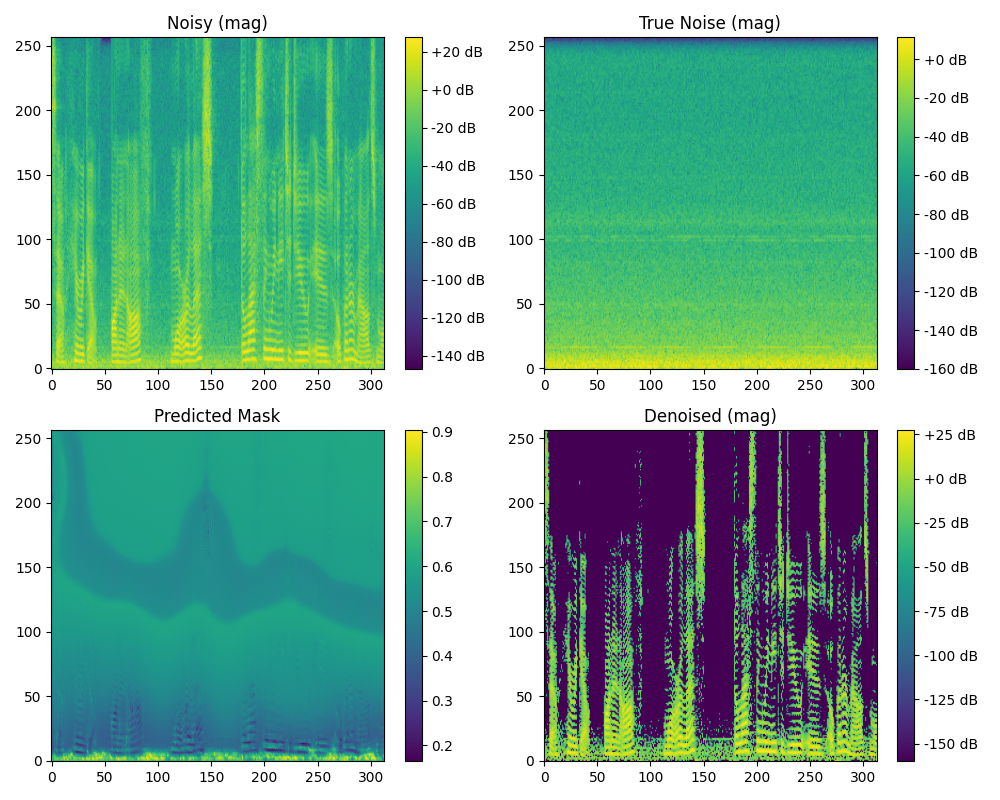
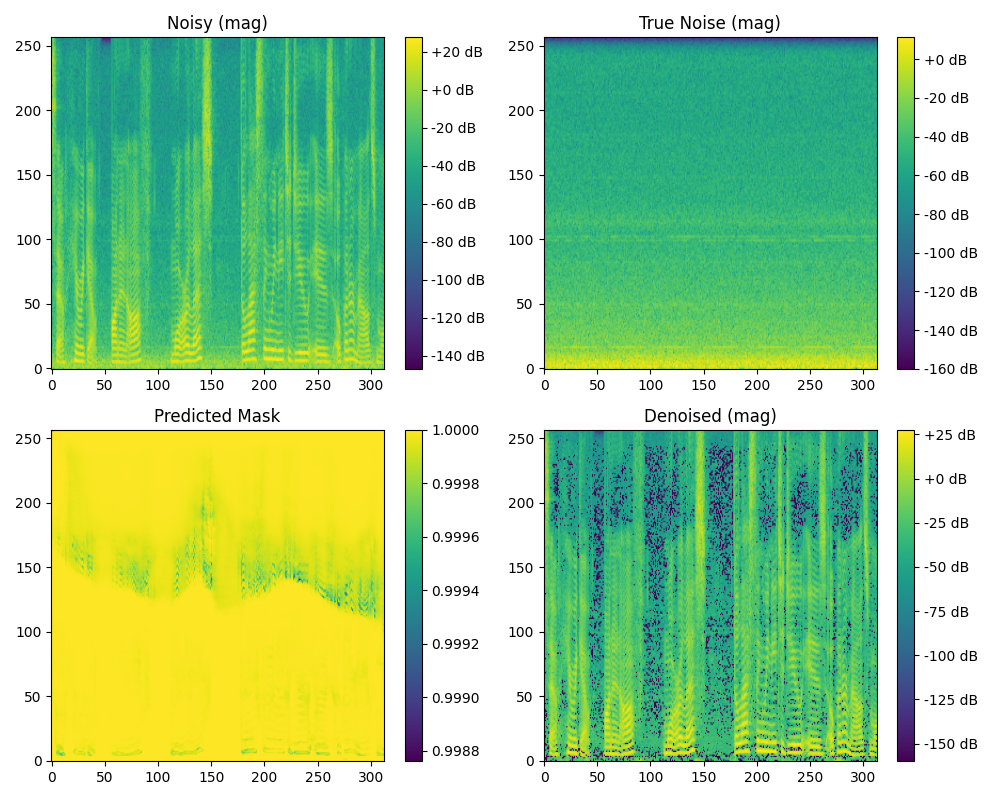

 Spectral Dehazing U-Net

Spectral Illumination–Guided Noise Removal for Vocal Recordings

This project adapts image dehazing concepts into the audio domain, converting techniques traditionally used for removing haze from photographs into methods for removing noise from vocal spectrograms.

The model is trained on paired noisy and noise-only vocal samples (≈1750 pairs) and produces noticeably cleaner vocals after around 50–60 epochs of training.
This repo includes:

- Full preprocessing pipeline
- Cached dataset for ultra-fast training
- Hybrid U-Net architecture
- Illumination (veil layer) estimation
- Mask + gate noise suppression
- Inference script
- Spectrogram visualizations

---

 Key Idea

Image dehazing separates haze veil from the true scene.
Here, we treat noise like “audio haze.”

- Veil layer → Log-domain illumination of spectrogram
- Transmission map → Noise mask + spectral gate
- Guided filter smoothing → TV loss for smooth masks

This lets the model separate noise structurally, not just with brute-force filtering.

---

🧠 Model Overview

Hybrid U-Net Structure

The model predicts:

1. "pred_mask" – A soft noise suppression mask
2. "pred_veil" – A spectral illumination (veil) map
3. "pred_clean" – Reconstructed clean magnitude

Final output is a gated combination of the predictions.

noisy_mag
   │
   ▼
U-Net → mask + veil → gated clean estimate → output

---

🛠 Features

✔ Illumination Estimation (Veil Layer)

Adapted from image dehazing.
Using MSR (multi-scale retinex) + guided filter (numpy-based approximation).

✔ Mask + Gate

Inspired by transmission maps in dehazing papers.
We use sigmoid-gated fusion.

✔ Total Variation (TV) Smoothness

Replaces guided-filter refinements with a differentiable smoother.

✔ Audio Augmentation

To increase sample variability:

✔ Preprocessing & Caching

We preprocess once → store as ".pt" tensors → training becomes 20–40× faster.

---

 Repository Structure

.
├── code/
│   ├── dataset.py
│   ├── preprocess.py
│   ├── model.py
│   ├── train.py
│   └── infer.py
├── checkpoints/
│   ├── hybrid_epoch_058.pth
└── README.md

---

 Preprocessing

Run once:

python preprocess.py \
  --noise_dir /path/noise \
  --noisy_dir /path/noisy \
  --cache_dir ./cache \
  --sample_rate 16000

This saves tensors like:

cache/
  0001.pt
  0002.pt
  ...

---

🧪 Training

python train.py --cache_dir ./cache --epochs 60

Supports auto-resuming:

checkpoints/
  hybrid_epoch_058.pth

---

 Inference

python infer.py \
  --input noisy.wav \
  --checkpoint checkpoints/hybrid_epoch_058.pth \
  --output cleaned.wav

---

 Spectrogram Results

###Epoch 1 Result

###Epoch 32 Result

###Epoch 58 Result (Best)

 Inspiration & Acknowledgement

This work is inspired by ideas from single-image dehazing research, specifically:

- Veil layer estimation (illumination modeling)
- Transmission map estimation
- Guided-filter style refinement
- Atmospheric scattering model

Original concepts appear in:
“Single Image Haze Removal Using … (Fan Guo et al.)”

The project does not copy the method directly — instead, it reinterprets dehazing concepts for audio spectrogram denoising, with a completely different architecture and loss design.

No authors contributed to this audio model; only the conceptual inspiration is cited.

---

🧭 Roadmap

- Add Griffin-Lim / neural vocoder for even better reconstruction
- Add Mel spectrogram mode
- Add Wav2Vec feature guidance
- Improve mask sharpness with edge-preserving losses
- Deploy as a real-time demo (WebGPU/WebRTC)

---

🤝 Contributions

Feel free to fork, PR, or open issues.

---

⭐ If This Helped

Drop a star on the repo — it motivates the grind :)
